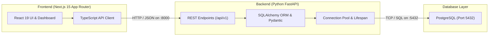

# KPM Full-Stack Application

A modern full-stack web application built with **Next.js 15 (React 19)** for the frontend, **Python FastAPI** for the backend, and **PostgreSQL** with **SQLAlchemy ORM** for persistent storage.

---

## 🏗️ Architecture Overview



---

## 📁 Project Structure

```text
kpm app/
├── frontend/                     # Next.js 15 App Router Frontend
│   ├── src/
│   │   ├── app/                  # App Router pages & layout
│   │   │   ├── layout.tsx
│   │   │   ├── page.tsx          # Main interactive dashboard
│   │   │   └── globals.css       # Tailwind CSS styles
│   │   ├── components/           # UI Components
│   │   │   ├── Header.tsx        # Navigation & real-time health indicator
│   │   │   ├── BackendStatusCard.tsx # Telemetry & DB connection monitor
│   │   │   ├── ItemManager.tsx   # Interactive PostgreSQL CRUD interface
│   │   │   └── ArchitectureCard.tsx  # Stack flow & quick commands
│   │   ├── lib/
│   │   │   └── api.ts            # Type-safe API client
│   │   └── types/
│   │       └── index.ts          # TypeScript interfaces & DTOs
│   ├── package.json
│   └── tsconfig.json
│
├── backend/                      # Python FastAPI Backend
│   ├── app/
│   │   ├── api/
│   │   │   ├── endpoints/
│   │   │   │   ├── health.py     # System & database health checker
│   │   │   │   └── items.py      # Full CRUD endpoints (/api/v1/items)
│   │   │   └── router.py         # API v1 central router
│   │   ├── core/
│   │   │   ├── config.py         # Pydantic Settings & environment
│   │   │   └── database.py       # SQLAlchemy engine, session & auto-init
│   │   ├── models/
│   │   │   └── item.py           # Item SQLAlchemy database model
│   │   ├── schemas/
│   │   │   └── item.py           # Pydantic validation schemas
│   │   └── main.py               # FastAPI application entrypoint
│   ├── .env.example              # Environment variables template
│   ├── .env                      # Local environment settings
│   └── requirements.txt          # Python dependencies
│
├── docker-compose.yml            # Docker definition for PostgreSQL & pgAdmin
├── package.json                  # Root orchestration script runner
├── run-all.ps1                   # One-click Windows PowerShell starter
└── README.md                     # Documentation
```

---

## 🚀 Quick Start

### Option A: One-Click Startup (PowerShell)
Run the starter script from the root directory to launch both servers in independent windows:
```powershell
.\run-all.ps1
```

---

### Option B: Running Manually

#### 1. Start the Python Backend
```powershell
cd backend
.\.venv\Scripts\python.exe -m uvicorn app.main:app --reload --port 8000 --host 127.0.0.1
```
- **Backend API Base**: [http://127.0.0.1:8000](http://127.0.0.1:8000)
- **Interactive Swagger Docs**: [http://127.0.0.1:8000/docs](http://127.0.0.1:8000/docs)
- **ReDoc Documentation**: [http://127.0.0.1:8000/redoc](http://127.0.0.1:8000/redoc)

#### 2. Start the Next.js Frontend
```powershell
cd frontend
npm run dev
```
- **Frontend URL**: [http://localhost:3000](http://localhost:3000)

---

## 🗄️ PostgreSQL Database Configuration

The backend is pre-configured with environment variables in `backend/.env`.

### 1. Using Local Windows PostgreSQL Service
If using your installed PostgreSQL service:
1. Open `backend/.env` and ensure your PostgreSQL password and database name match:
   ```env
   POSTGRES_SERVER=localhost
   POSTGRES_PORT=5432
   POSTGRES_USER=postgres
   POSTGRES_PASSWORD=your_password
   POSTGRES_DB=kpm_db
   ```
2. Create the database in PostgreSQL if it doesn't already exist:
   ```powershell
   & "C:\Program Files\PostgreSQL\18\bin\createdb.exe" -U postgres kpm_db
   ```
3. When FastAPI starts, SQLAlchemy will automatically create required tables (`items`).

### 2. Using Containerized PostgreSQL (Docker)
Alternatively, if you prefer Docker:
```bash
docker compose up -d postgres
```
- **PostgreSQL Port**: `5432` (Username: `postgres`, Password: `postgres`, DB: `kpm_db`)
- **pgAdmin (Optional)**: [http://localhost:5050](http://localhost:5050) (Email: `admin@example.com`, Password: `admin`)

---

## 📡 API Endpoints

| Method | Endpoint | Description |
|---|---|---|
| `GET` | `/` | Root API status & route index |
| `GET` | `/docs` | Swagger interactive OpenAPI documentation |
| `GET` | `/api/v1/health` | Backend & PostgreSQL live connectivity status |
| `GET` | `/api/v1/items/` | List all records (supports search & filter) |
| `POST` | `/api/v1/items/` | Create a new record in PostgreSQL |
| `GET` | `/api/v1/items/{id}` | Get item details by ID |
| `PUT` | `/api/v1/items/{id}` | Update item by ID |
| `DELETE` | `/api/v1/items/{id}` | Delete item from PostgreSQL |
