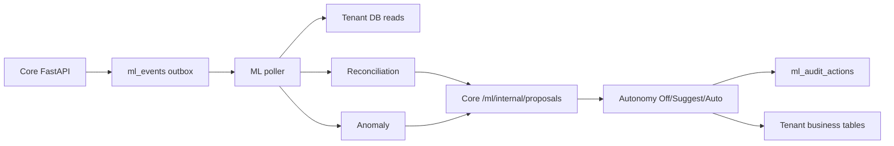

# KPM ML Service

Tenant-scoped classical ML for KPM: **reconciliation matching** and **anomaly flagging**. Runs as a separate FastAPI process and talks to the core app through a Postgres **outbox** (`ml_events`) plus internal proposal APIs.

## Architecture



| Layer | Choice (MVP) |
|-------|----------------|
| Serving | FastAPI (`ml-service`) |
| Events | Postgres outbox `ml_events` |
| Features | Live SQL reads per `owner_id` (+ future `ml_*` tables) |
| Models | Rules + sklearn; `registry/{tenant}/{model}/{version}/` |
| Orchestration | `python -m app.worker` |
| Monitoring | Structured logs; audit undo rate in core |

**Hard rules:** never train or score across tenants; anomaly **Auto = flag only** (no book edits/voids in v1).

## Features

### Reconciliation (payment ↔ open order)

| Feature | Description |
|---------|-------------|
| `abs_amount_diff` | Absolute amount gap |
| `amount_ratio` | min/max amount |
| `days_apart` | Calendar days between payment and order |
| `ref_exact` | Order number substring in reference/description |
| `ref_token_overlap` | Jaccard on tokens |
| `name_similarity` | Counterparty vs customer name |

- **Cold start:** rules only (exact amount ±1 day + reference helps).
- **Ranker:** optional sklearn model after ≥50 confirmed matches (`ml_match_links`).
- **Thresholds:** Suggest ≥0.70; Auto ≥0.92 and unique (top−second ≥0.15).
- **Undo:** unlinks `ml_match_links` and restores prior payment status.

### Anomaly detection

| Signal | Description |
|--------|-------------|
| `duplicate_fingerprint` | customer + amount + day + items_count |
| `amount_vs_median` | vs 30d / recent median |
| `price_jump` | vs last known SKU price |
| `new_counterparty` | first-seen payee/payer |
| `order_velocity` | many orders same day |
| IsolationForest | per-tenant after ≥200 transactions |

- Soft → Suggest flag; Auto → **create flag only**.
- Dismiss/undo clears `ml_anomaly_flags`.

## Run locally

```bash
# from ml-service/
python -m venv .venv
# Windows:
.venv\Scripts\pip install -r requirements.txt
.venv\Scripts\uvicorn app.main:app --reload --port 8001 --host 127.0.0.1

# worker (separate terminal; core API must be up)
.venv\Scripts\python -m app.worker
```

Environment (optional `.env`):

```
CORE_API_BASE=http://127.0.0.1:8000/api/v1
ML_SERVICE_TOKEN=   # must match backend ML_SERVICE_TOKEN when set
DATABASE_URL=       # same DB as core, or leave empty for SQLite sibling backend/kpm_app.db
REGISTRY_ROOT=registry
POLL_INTERVAL_SEC=5
```

Core emits on:

- `order.created` / `invoice.posted` (sales)
- `payment.received` / `transaction.created` (accounting)
- `stock.adjusted` (inventory)

Core accepts proposals at `POST /api/v1/ml/internal/proposals` and applies **Off / Suggest / Auto** from onboarding automation modes (`reconcile`, `flag_anomalies`).

## Registry layout

```
registry/
  {tenant_id}/
    recon_ranker/{version}/meta.json + model.joblib
    anomaly_if/{version}/meta.json + model.joblib
```

Upgrade path: MLflow later without changing proposal/audit contracts.

## Roadmap trust gates

1. Rules recon + Suggest + audit — precision check before Auto  
2. Anomaly rules/IF Suggest; Auto = flag only  
3. Recon ranker + Auto after Suggest bake-in (undo &lt;5%)  
4. Forecast / ROP Suggest (ETS/Croston; draft PO)  
5. Tool-calling Q&A into tenant read APIs  
6. Risk scorecards Suggest  

## Out of scope (this phase)

Redis/Kafka, Feast, MLflow, deep learning, live bank OAuth, cross-tenant models, Auto book voiding.

## Later use cases (spec only)

- **Forecast:** ETS/Croston on SKU sales; cold start = category velocity / `low_stock_threshold`.
- **ROP:** forecast + supplier lead time → Suggest draft PO.
- **Q&A:** LLM tool-calling into tenant read APIs only.
- **Risk:** scorecards on customers/suppliers.
